# Unlimited-OCR on real archival documents

A 3-billion-parameter open-weights OCR model came out this month — [Baidu's Unlimited-OCR](https://huggingface.co/baidu/Unlimited-OCR), MIT licensed. I tested it against the OCR engines I've been using for archive work on four real documents: two from the Vietnam Veterans of America collection, two from a 1919 U.S. Army hospital newspaper called *ASYOUWERE*.

This file is the long-form writeup. The repo: <https://github.com/tcondello/unlimited-ocr-archive-test>

---

## The LinkedIn post

> A 3B open-weights vision model matched Claude Sonnet 4.5 character-for-character on a 3-page Vietnam-era typewritten letter — 5121 vs 5157 chars, byte-identical opening, 59 seconds on a Colab T4 at zero per-call cost.
>
> Then on a handwritten 1966 postcard, the same model emitted *six characters* — just `<PAGE>` — where Claude got 794 chars clean.
>
> The takeaway isn't "open weights won" or "API won." It's that **routing by document type matters more than picking one engine.** Typed correspondence → 3B local model. Cursive ballpoint → keep paying for the API.
>
> Repo with the docs, the script, the bounding-box visualizations, and the side-by-side outputs: [link]

---

## The four documents

I picked these because I already had OCR ground truth on them from prior runs (Claude Sonnet 4.5 vision on the VVA docs, docling on the newspapers), and because they span the failure modes that actually matter for historical archive OCR.

### VVA — Vietnam Veterans of America

**`vva/2710101001.pdf`** — Postcard from Dan Siewert, July 1966. Handwritten ballpoint, 2 pages (photo + back side).

<table><tr>
<td>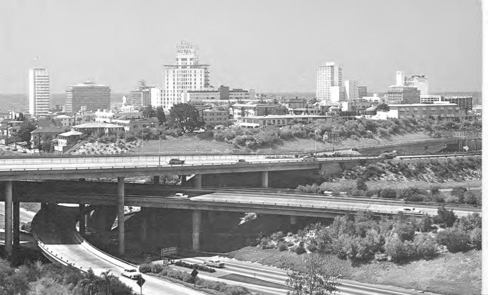</td>
<td>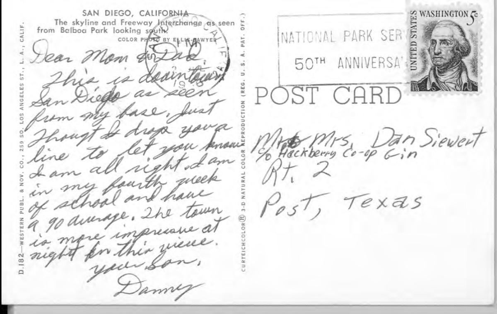</td>
</tr></table>

**`vva/23930102001.pdf`** — Letter from Stephen B. Wright to his mother, March 1968. Typewriter with handwritten signature, 3 pages.

<table><tr>
<td>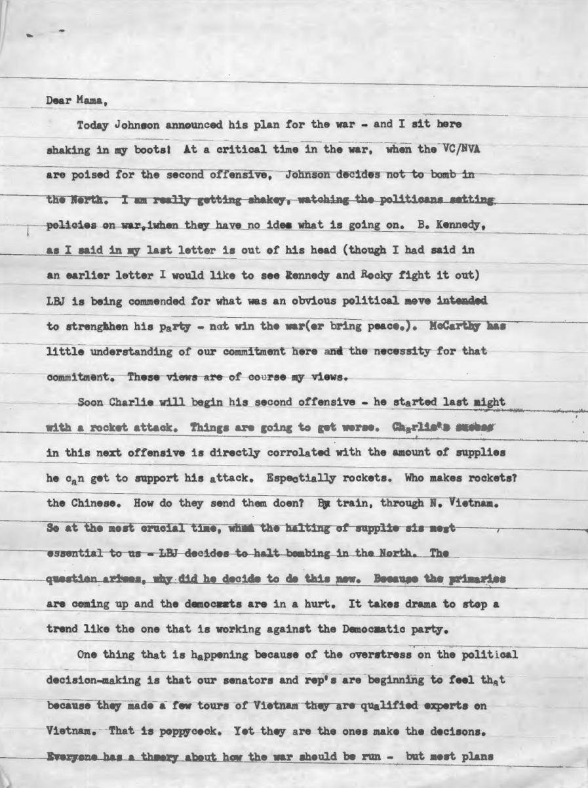</td>
<td>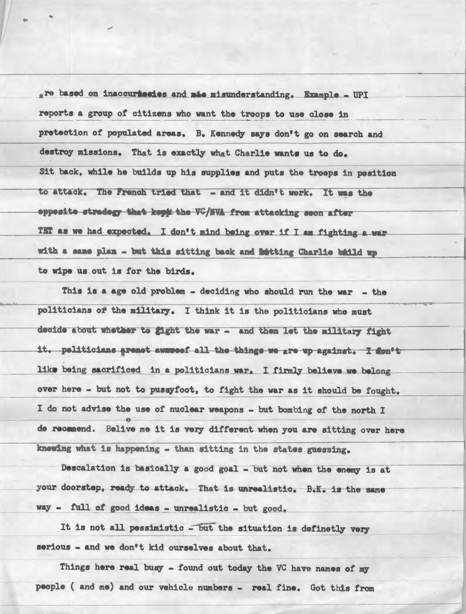</td>
<td>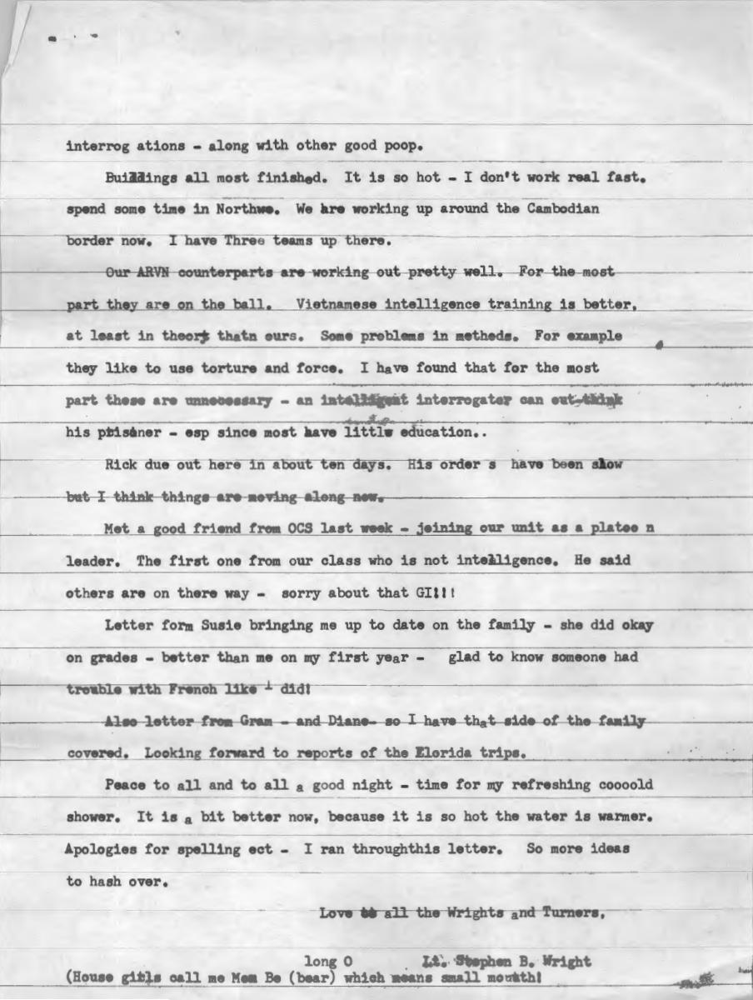</td>
</tr></table>

### ASYOUWERE — U.S. Army General Hospital No. 24, Pittsburgh

**`asyouwere/52420710RX1.pdf`** — Vol. I, No. 1, February 15, 1919. Printed newsprint, multi-column.

<table><tr>
<td>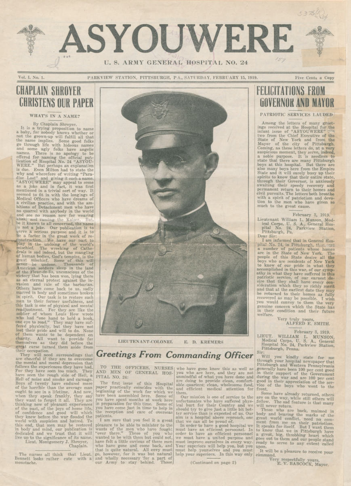</td>
<td>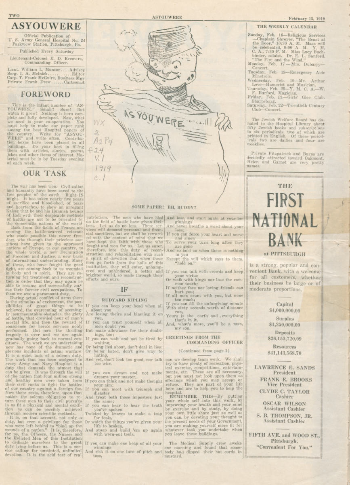</td>
<td>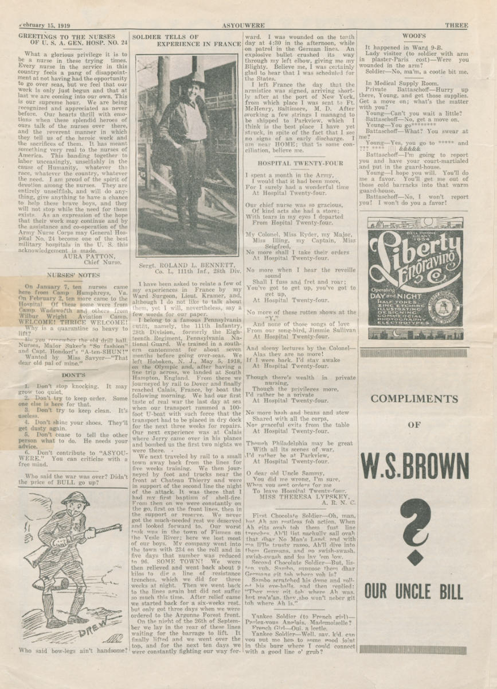</td>
</tr></table>

**`asyouwere/52420710RX2.pdf`** — Vol. I, No. 2, February 22, 1919. Same format, includes a half-page photo and a table.

<table><tr>
<td>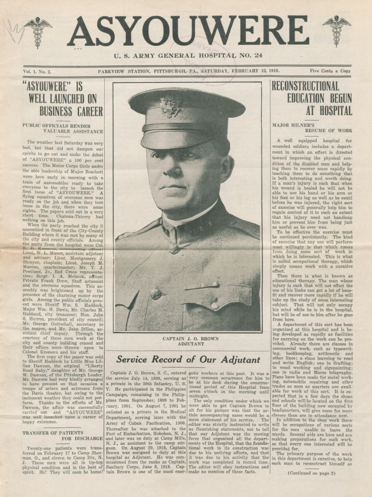</td>
<td>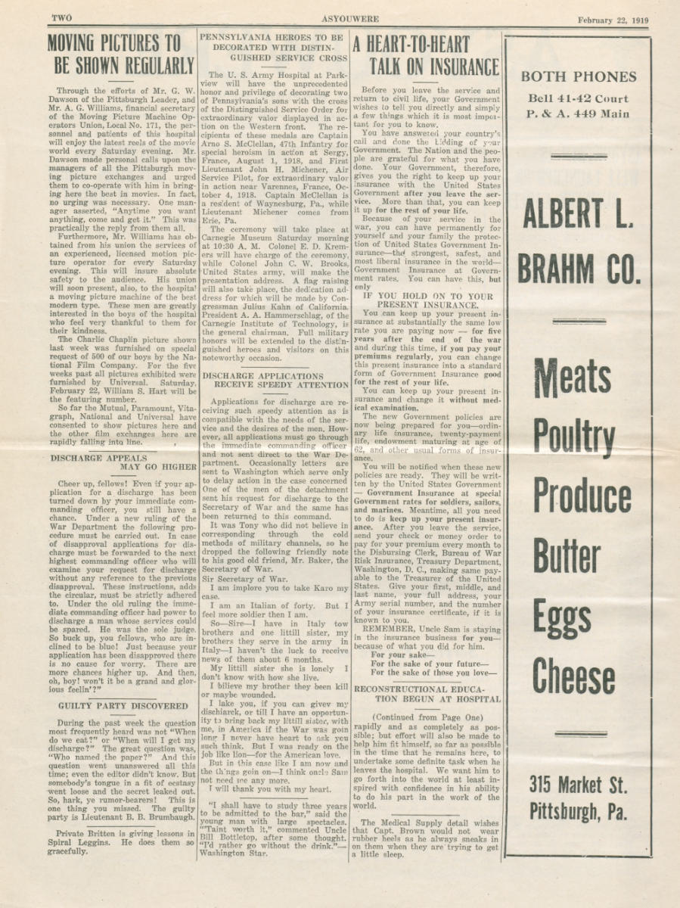</td>
<td>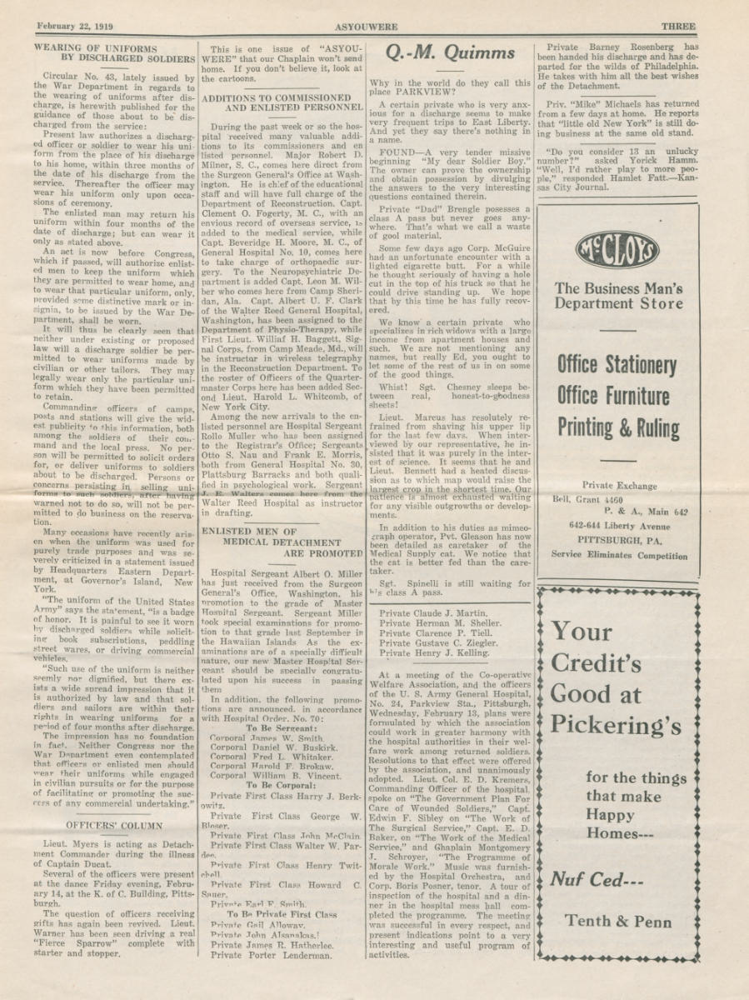</td>
</tr></table>

---

## ✅ Where Unlimited-OCR passed — the 1968 letter

3 typed pages, ~5 KB of dense prose. The model matched Claude Sonnet 4.5 vision character-for-character at zero per-call cost.

| Engine | chars | wall (s) | cost |
|---|---:|---:|---:|
| Claude Sonnet 4.5 vision | 5157 | 56.7 | ~$0.04 |
| **Unlimited-OCR (Gundam)** | **5121** | **58.9** | **$0** (Colab T4) |

The model emitted real bounding boxes overlaid on the document — those visualizations are committed to the repo as the audit trail:

<table><tr>
<td>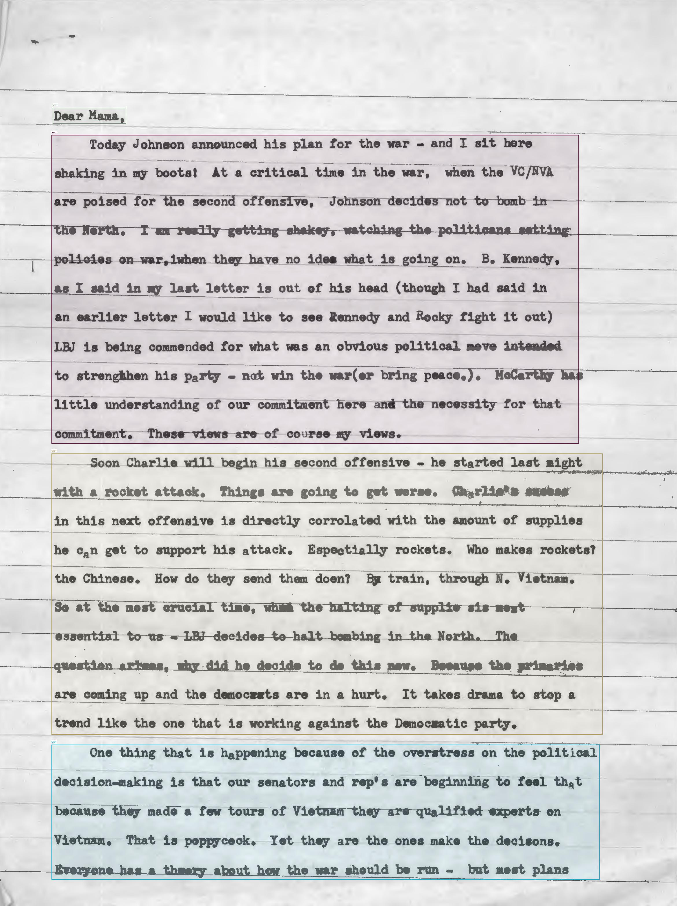</td>
<td>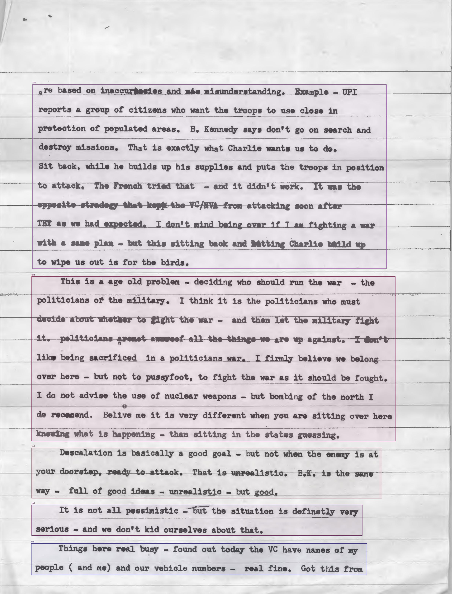</td>
<td>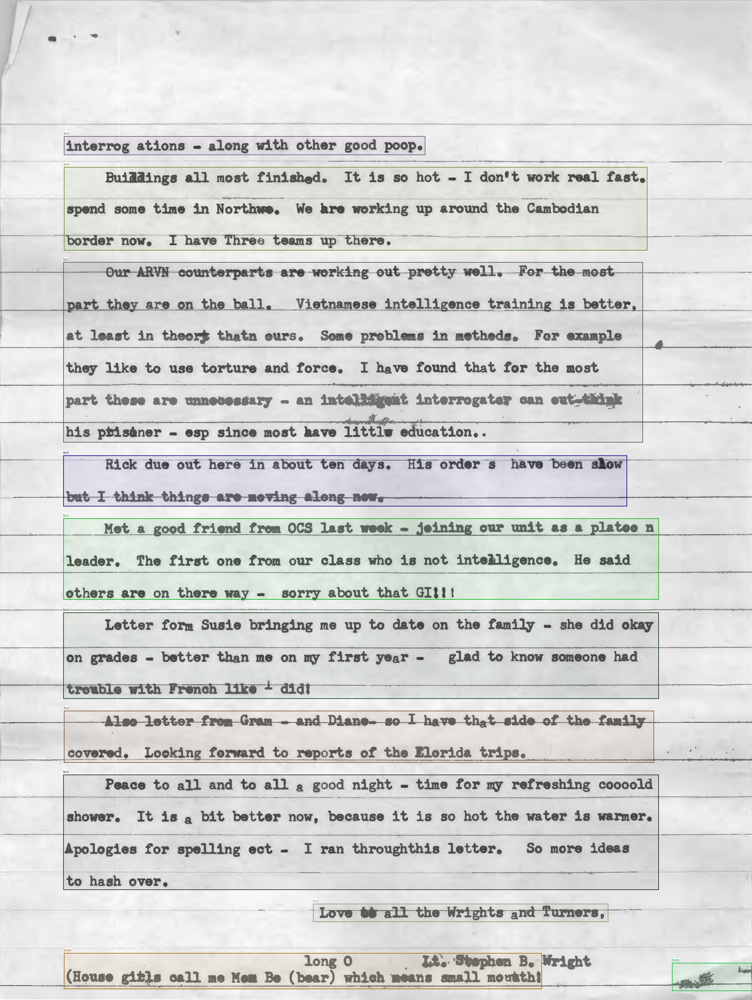</td>
</tr></table>

Opening sentence, byte-identical between the two engines:

> *"Dear Mama, Today Johnson announced his plan for the war - and I sit here shaking in my boots! At a critical time in the war, when the VC/NVA are poised for the second offensive, Johnson decides not to bomb in the North."*

The full Unlimited-OCR output: [`outputs/vva/23930102001.unlimited-ocr.txt`](outputs/vva/23930102001.unlimited-ocr.txt). The Claude baseline: [`baselines/vva/23930102001.claude-sonnet-4-5.txt`](baselines/vva/23930102001.claude-sonnet-4-5.txt).

---

## ❌ Where Unlimited-OCR failed — the 1966 postcard

Same engine, same configuration, same Colab T4. The handwritten ballpoint postcard was a complete blind spot.

| Engine | chars | wall (s) | cost |
|---|---:|---:|---:|
| Claude Sonnet 4.5 vision | 794 | 12.7 | ~$0.014 |
| Unlimited-OCR (Gundam) | **6** (`<PAGE>`) | 7.2 | $0 (Colab T4) |

The "where it passed" run produced three bounding-box overlay images. The postcard run produced **zero** — only an empty `result.md` containing `<PAGE>`:

```
$ cat outputs/_raw/2710101001/result.md
<PAGE>
```

This isn't a parsing or post-processing failure. The model itself didn't detect any text regions on the postcard. Compare to Claude's clean transcription on the same input ([baselines/vva/2710101001.claude-sonnet-4-5.txt](baselines/vva/2710101001.claude-sonnet-4-5.txt)):

> *"SAN DIEGO, CALIFORNIA — The skyline and Freeway Interchange as seen from Balboa Park looking south. […] Dear Mom & Dad — This is definitely San Diego as seen from sky fare, Just throught I drop you a line to let you know I am all right & am in my fourth week of school and have a 90 average. […] Your Son, Danny"*

Handwriting on this archive is the exact failure mode I'd been paying Claude $0.04 a doc to handle. That moat hasn't moved.

---

## ⏳ ASYOUWERE — pending

The two 1919 newspapers are the harder case: multi-column dense newsprint, 4–8 pages each, with embedded photos and tables. First T4 run hit Colab's WebSocket-saturation quirk under Unlimited-OCR's verbose token output (Gundam mode emits hundreds of `<|det|>header [x,y,w,h]<|/det|>` tokens per page) before finishing the first newspaper.

Currently running with `MODE=base` (single inference pass per page, no cropping) which should be ~3–4× faster on the T4. Will update this section with results.

Baseline already in the repo for comparison: [`baselines/asyouwere/*.docling.md`](baselines/asyouwere/) — docling, which has explicit layout analysis and handles multi-column print cleanly. The interesting question is whether a pure VLM preserves column order on newsprint.

---

## How to read the repo

```
docs/<src>/*.pdf                            Source PDFs (4 docs, 2 corpora)
docs_preview/*.jpg                          Page-image previews used in this writeup
baselines/<src>/*.{claude-*,docling}.txt    Prior-engine OCR — committed ground truth
outputs/<src>/*.unlimited-ocr.{txt,meta}    What Unlimited-OCR produced
outputs/_raw/<stem>/                        Raw model artifacts (bbox JPEGs, result.md)
outputs/comparison.md                       Auto-rendered side-by-side table

unlimited_ocr_test.py                       PEP 723 single-file OCR script
nuextract3_test.py                          NuExtract 3 (pending — OOM fix applied, not yet rerun)
compare.py                                  Builds outputs/comparison.md

recipes/colab_runner.py                     Self-runner for tcondello/uv-scripts-colab
scripts/pull_results.py                     Pull HF dataset into local outputs/
```

The whole bake-off rides on a managed Colab T4 with two commands:

```bash
OUTPUT_DATASET=your-hf-user/unlimited-ocr-archive-test \
  ~/Code/uv-scripts-colab/bin/colab-hf-run recipes/colab_runner.py

HF_DATASET=your-hf-user/unlimited-ocr-archive-test \
  uv run scripts/pull_results.py
```

No local GPU required; the recipe round-trips through HF Hub.

---

## Methodology notes

- All engines hit identical input bytes — the same PDFs in `docs/`.
- Wall-clock times are not strictly comparable across engines (Claude is one API call, Unlimited-OCR is local inference) but they're useful for sanity. Both ~60s on a 5 KB letter is the interesting overlap.
- The `chars` column is `len(text)` of the extracted output. Not edit-distance against truth — there's no truth file, and producing one would itself be an OCR task. The byte-identical opening sentence is a strong qualitative signal that this isn't an artifact of similar character counts.
- I haven't computed precision/recall on extracted text against a hand-typed ground truth. For this archive that's a separate project.

## Honest caveats

- One archive, four docs, one run. Not a benchmark. A signal.
- I tested Gundam mode by default. The model also ships a "Base" mode (no cropping, single image at native res). The postcard failure may be mode-specific — worth a follow-up.
- NuExtract 3 is in the repo as a second open-weights engine but OOM'd on the T4 in the first run. The fix (resize to 1280px max edge, empty cache between pages) is committed but not yet re-run. When it does run, it'll be in OCR mode with the template `{"full_text": "verbatim-string"}` — which is off-label for a structured extractor, but produces a fair single-call OCR baseline on the same hardware.

---

*Built on top of [`tcondello/uv-scripts-colab`](https://github.com/tcondello/uv-scripts-colab) — one-file Python recipes that read a dataset from the Hugging Face Hub, run on a managed Colab GPU, and push results back. The OCR bake-off is one self-runner recipe (`recipes/colab_runner.py`) plus the two engine scripts.*
